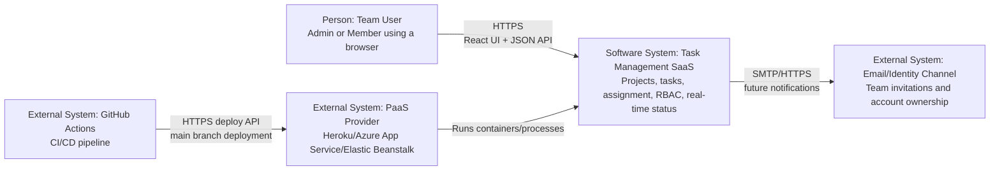
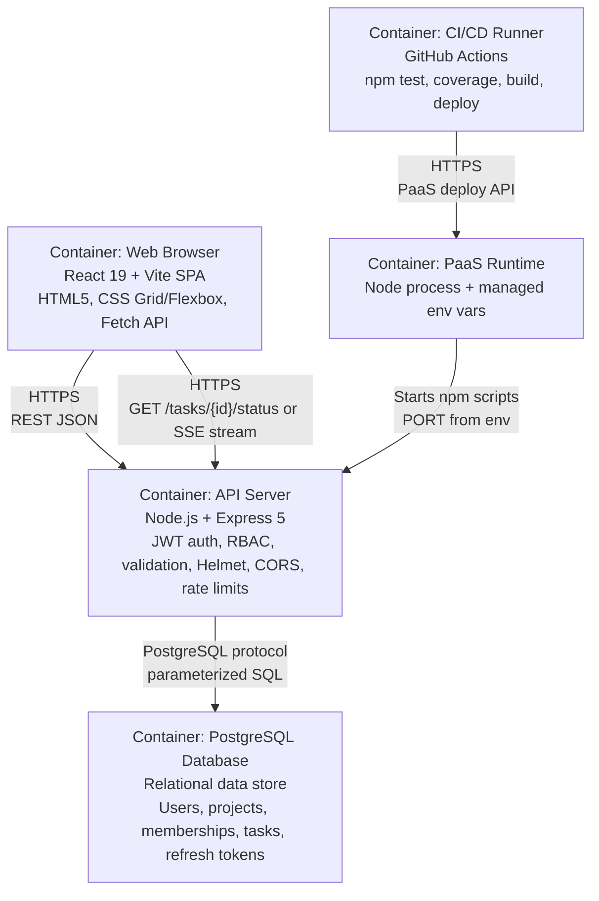
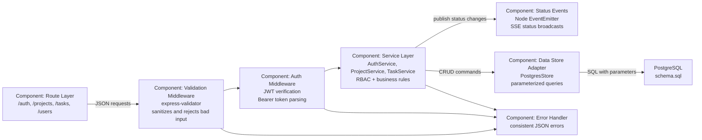
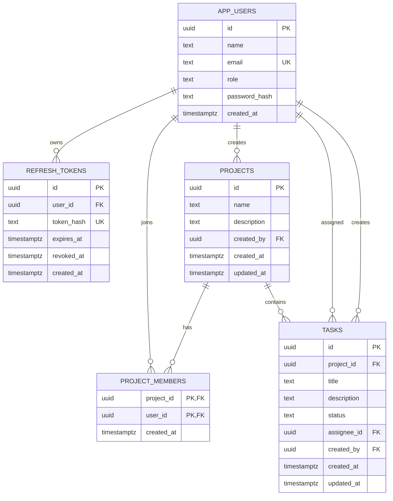

# Task Management SaaS Platform: Architecture and Design

## Q1. System Architecture (C4 Model)

### C4 Context Diagram: Task Management SaaS Platform

Technology choices: React SPA, Node.js/Express REST API, PostgreSQL, JWT authentication, PaaS hosting.  
Primary protocols: HTTPS for browser/API traffic, JSON over REST, Server-Sent Events/polling for task status, PostgreSQL wire protocol for persistence.

### C4 Container Diagram: Runtime Containers

### C4 Component Diagram: Express API

## Q2. Database Design

### Entity-Relationship Diagram

### Database Choice

PostgreSQL is used because the domain is relational: users belong to many projects through memberships, projects contain many tasks, and tasks are assigned to users. Relational constraints protect business rules such as valid roles, valid task statuses, cascading project deletion, and foreign-key integrity. PostgreSQL also supports strong indexing, transactions, UUIDs, managed PaaS add-ons, and parameterized queries through the `pg` driver.

### Indexing Strategy

| Query pattern | Index | Reason |
| --- | --- | --- |
| Login by email | `idx_app_users_email_lower` on `lower(email)` | Fast case-insensitive login lookup and uniqueness. |
| Validate active refresh token | unique `refresh_tokens.token_hash`, plus `idx_refresh_tokens_user_active` | Fast token rotation/logout checks without storing raw tokens. |
| List projects assigned to member | primary key on `(project_id, user_id)` and `idx_project_members_user_id` | Supports RBAC project filtering by current user. |
| List project tasks by status and recent activity | `idx_tasks_project_status_updated` | Supports board views filtered by project/status and sorted by latest update. |
| List tasks assigned to a member | `idx_tasks_assignee_status` | Supports personal task queues and status filters. |

## Q3. API Contract

The OpenAPI 3.0 contract is maintained in [`docs/openapi.yaml`](openapi.yaml). It includes authentication, refresh/logout, project CRUD, member assignment, task CRUD, and the status polling/SSE endpoints.

## Q8. PaaS Deployment

Recommended deployment target: Heroku or Azure App Service with a managed PostgreSQL add-on.

Required environment variables:

| Name | Purpose |
| --- | --- |
| `DATABASE_URL` | Managed PostgreSQL connection string. |
| `JWT_SECRET` | Access-token signing secret. |
| `JWT_REFRESH_SECRET` | Refresh-token signing secret. |
| `JWT_ACCESS_TTL` | Access-token lifetime, for example `15m`. |
| `JWT_REFRESH_TTL` | Refresh-token lifetime, for example `7d`. |
| `CORS_ORIGIN` | Allowed frontend origin. |
| `FORCE_HTTPS` | Set to `true` in production. |
| `DB_SSL` | Set to `true` when the managed database requires TLS. |
| `VITE_API_BASE_URL` | Frontend build-time API base URL, for example `https://your-app.herokuapp.com/api`. |

Deployment steps:

1. Provision the PaaS app and managed PostgreSQL database.
2. Add all environment variables in the PaaS dashboard or CLI.
3. Run `backend/express-server/db/schema.sql` against the managed database.
4. Configure GitHub repository secrets for CI/CD.
5. Merge to `main`; the workflow runs tests and deploys only if tests pass.

Live URL for submission: replace this with the deployed PaaS URL after provisioning, for example `https://task-manager-saas.herokuapp.com`.

## Q9. CI/CD Pipeline

The GitHub Actions workflow at [`.github/workflows/ci-cd.yml`](../.github/workflows/ci-cd.yml) runs:

- Backend dependency installation and Jest tests with coverage.
- Frontend dependency installation and Vite production build.
- Automatic Heroku deployment on pushes to `main`, guarded by successful tests/builds and required deployment secrets.

## Q10. Security Hardening

Implemented controls:

- HTTPS enforcement through `FORCE_HTTPS=true` and proxy-aware redirects.
- Security headers through `helmet`.
- Rate limiting on `/api/auth/*` endpoints using `express-rate-limit`.
- Input validation and sanitisation through `express-validator` and service-level string cleaning.
- CORS policy configuration through the `CORS_ORIGIN` environment variable.
- SQL injection prevention through `pg` parameterized queries; dynamic updates only use whitelisted column names.
- Refresh tokens are stored as SHA-256 hashes and rotated on refresh.
- RBAC enforces Admin and Member permissions at the service layer, not only in the frontend.

## Twelve-Factor Alignment

- Configuration is supplied through environment variables.
- Stateless API processes use JWT access tokens and database-backed refresh-token revocation.
- Dependencies are declared in package manifests.
- Logs are written to stdout/stderr for PaaS collection.
- The app binds to `PORT` supplied by the runtime.
- Backing services such as PostgreSQL are attached through `DATABASE_URL`.
